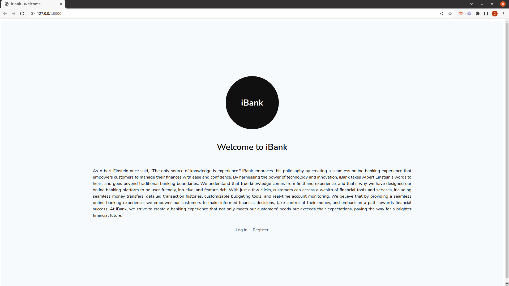
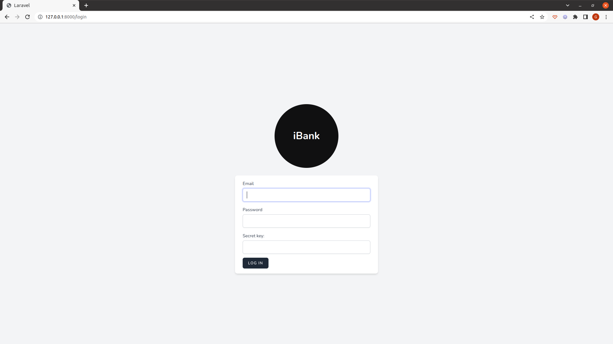
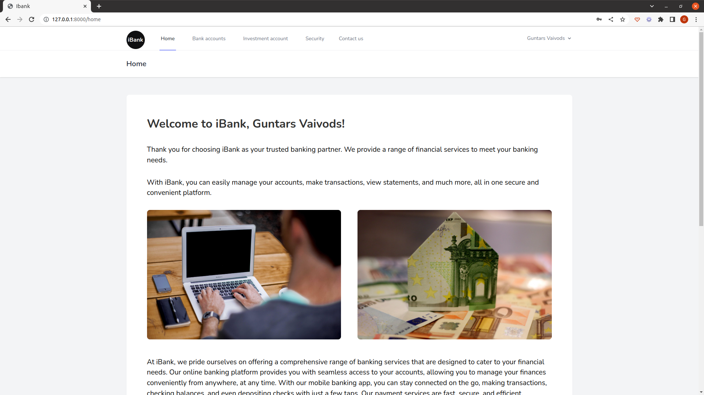
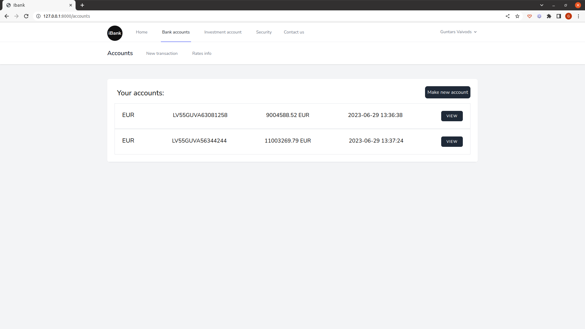
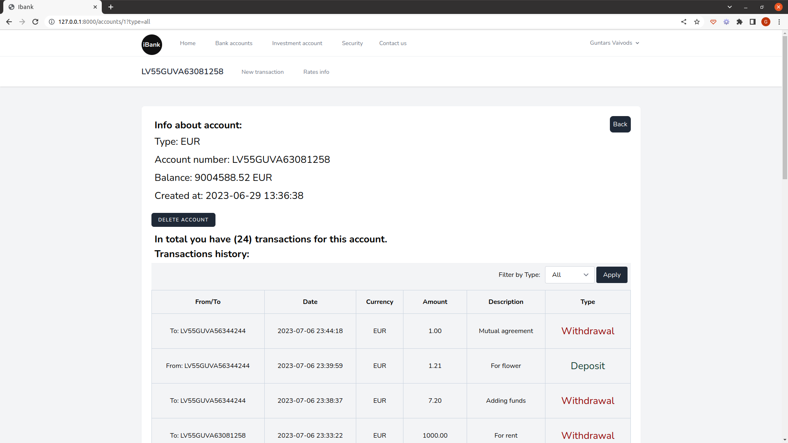
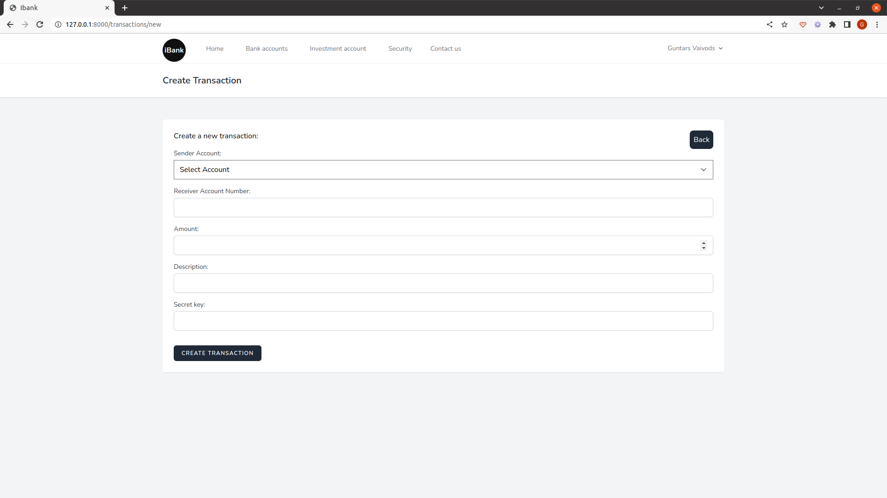
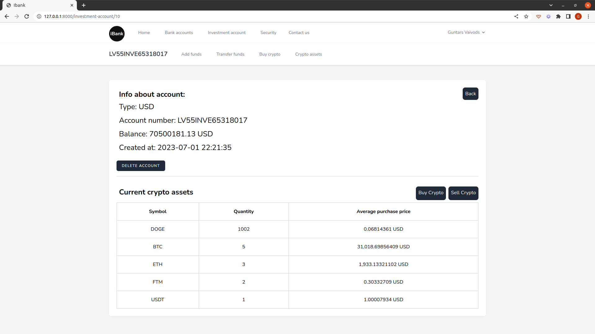
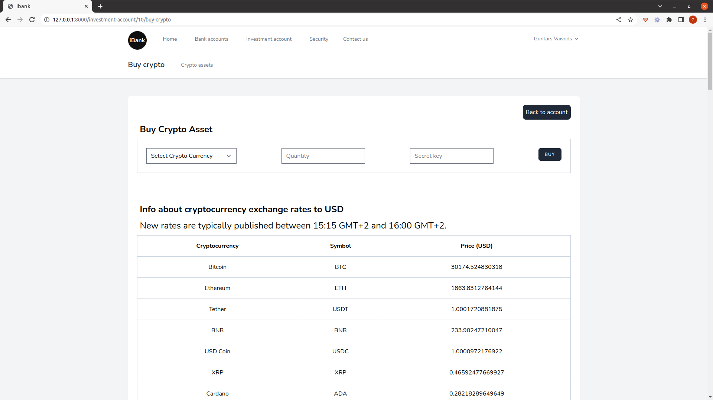
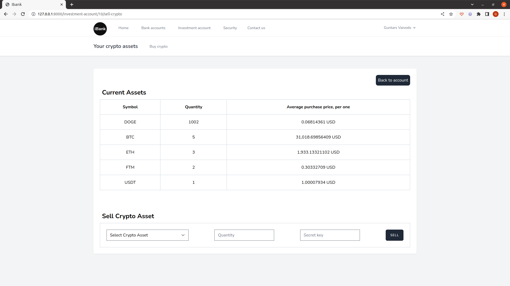
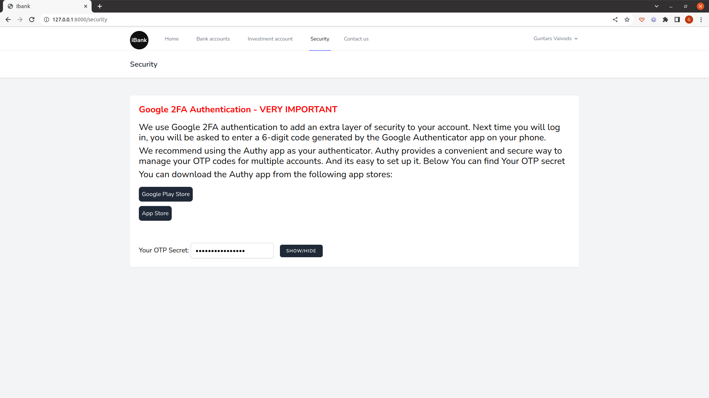

# iBank Project Setup

Welcome to the iBank project! This document provides step-by-step instructions to help you set up and run the project on your local machine.

## Key Features

- **Two-Factor Authentication (2FA):** iBank prioritizes user security by implementing a Two-Factor Authentication mechanism, providing an extra layer of protection for user logins and transactions.

- **Bank Account Management:** Users can easily manage their traditional bank accounts, view balances, and perform various financial operations effortlessly.

- **Investment Account Support:** iBank goes beyond traditional banking by allowing users to manage their investment accounts within the same application. This seamless integration simplifies users' financial management.

- **Cryptocurrency Transactions:** As a forward-thinking banking solution, iBank facilitates buying and selling of cryptocurrencies. Users can explore the world of digital assets through the application's user-friendly interface.

- **MySQL Database Integration:** The application stores and manages data using the reliable and efficient MySQL database, ensuring data integrity and performance.

- **API Integration:** iBank integrates two APIs to enhance functionality. The first API is dedicated to retrieving real-time currency exchange rates, while the second API provides up-to-date information on various cryptocurrencies, enabling users to make informed decisions.

## Page screenshots












## Prerequisites
Before you begin, ensure that you have the following prerequisites installed on your system:
- PHP (>= 7.3)
- Composer
- MySQL
- CoinMarketCap API Key (sign up at https://coinmarketcap.com/api/)

## Installation

1. Clone the repository to your local machine:
   ```bash
   git clone https://github.com/Guntars123/iBank.git

2. Navigate to the project directory:
    ```bash
    cd ibank
3. Install the project dependencies:
    ```bash
    composer install
4. Create a copy of the `.env.example` file and rename it to `.env`:
   
5. Open the .env file and set the following variables:

- DB_DATABASE: Your MySQL database name.
- DB_USERNAME: Your MySQL database username.
- DB_PASSWORD: Your MySQL database password.
- COINMARKETCAP_API_KEY: Your CoinMarketCap API key.

6. Generate an application key:
    ```bash
    php artisan key:generate
   
7. Run the database migrations:
    ```bash
    php artisan migrate
   
## Running the Application

1. Start the local development server:
    ```bash
    php artisan serv
   
2. Open the application in your browser!


